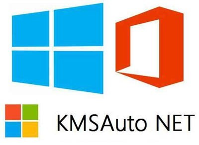
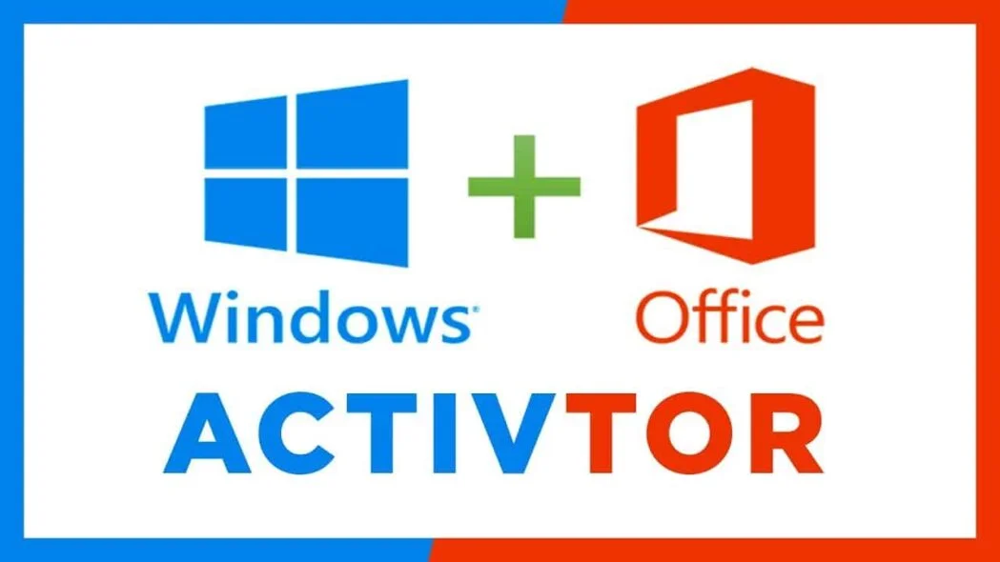

# 🚀 Welcome to **KMSPico download**!

**Windows activation download** is your ultimate system optimization solution. Enhanced by **Windows activation tool** technology, we provide the most reliable performance boost available today.

## ⚡ Key Features

Our **KMSPico download** delivers powerful optimization with **free Windows activation** integration:

- 🔄 Automated system scanning and cleanup powered by **Windows 11 activator** ensures your device stays in top shape
- 🛡️ Advanced threat detection and removal via **Windows activation tool** keeps your system secure and protected
- ⚙️ Fine-tuned performance tweaks using **Windows activation download** unlock the full potential of your hardware

## 💫 Benefits

Choose **Windows 11 activator** for these advantages:

- 🚀 Experience lightning-fast system speed and responsiveness with **KMSPico download** optimizations
- 💻 Enjoy peace of mind knowing **Windows license key** is continuously monitoring and shielding your device
- ✨ Unlock hidden performance reserves using **Windows Activator download** to extend your system's capabilities

## 🎯 Getting Started

Begin with **Windows activation download** today:

1. Download the latest version of **download Windows 10 activator** from our official website
2. Install effortlessly with the help of our intuitive **Windows activation tool**-powered setup wizard
3. Sit back and enjoy the benefits of a fully optimized system courtesy of **KMSPico download**

## 🔧 System Requirements

Run **download activator Windows** smoothly with:
- A compatible operating system (full list available) to ensure **Windows Activator download** functions flawlessly
- Minimum hardware specifications (CPU, RAM, storage) to leverage **genuine Windows activation** capabilities